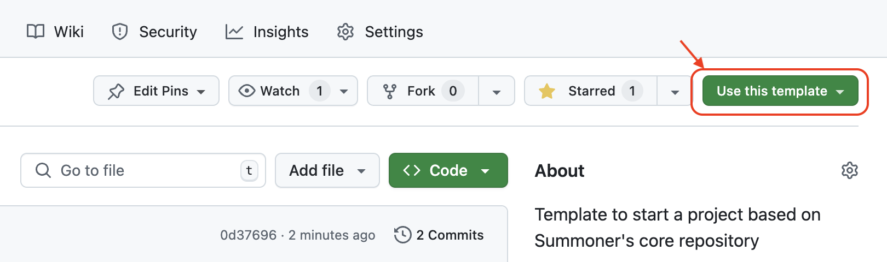

# Starter Template

This repository is a **starter template** for building Python and Rust projects that integrate with [Summoner’s core codebase](https://github.com/Summoner-Network/agent-sdk) for client/server communication.

It bootstraps a virtual environment, installs all dependencies, and provides tooling to validate the setup and run a test server.

## 🚀 Getting Started

To create your own project using this starter:

<p align="center">
  
</p>

1. Click the **"Use this template"** button at the top of the [GitHub repository page](https://github.com/Summoner-Network/starter-template).
2. Select **"Create a new repository"**.
3. Name your project and click **"Create repository from template"**.

This will create your own copy of the repo that you can clone and start working from.

## 🔧 Installation

First, clone the template repository and navigate into it:

```bash
git clone https://github.com/Summoner-Network/starter-template.git
cd starter-template
```

Then, to install Summoner’s core codebase and its Python and Rust dependencies:

```bash
source install.sh setup
```

This will:

* Clone Summoner’s core codebase into `summoner-src/`
* Create a virtual environment in `venv/`
* Install all required Python and Rust packages
* Install the core package into the environment

### Optional: Using `bash` Instead of `source`

You may also run:

```bash
bash install.sh setup
```

However, if you do, you will need to **activate the virtual environment manually**:

```bash
source venv/bin/activate
```

## ✅ Verifying the Installation

To launch a test server:

```bash
bash install.sh test_server
```

This will:

* Create `test_server.py`
* Create `test_server_config.json`
* Launch the server using the installed Summoner core package
* Generate `test_Server.log`

You should see no import errors in `test_server.py`. In particular, this line should be recognized:

```python
from summoner.server import SummonerServer
```

## 🧠 VSCode Integration

To ensure VSCode recognizes the Summoner core dependency and your virtual environment:

1. Open the Command Palette: `Ctrl+Shift+P` (or `Cmd+Shift+P` on macOS)
2. Run: `Python: Select Interpreter`
3. Select the one labeled `'venv':venv`

Once selected, VSCode will resolve `summoner` correctly as a dependency installed in `venv/lib`.

## 🧹 Cleaning and Resetting

To clean generated test files:

```bash
bash install.sh clean
```

This removes:

* Any `test_*.py` files
* Any `test_*.json` files
* Any `test_*.log` files

To fully reset the setup (delete `venv/` and `summoner-src/` and reinstall everything):

```bash
bash install.sh reset
```

To delete all environment and Summoner core files:

```bash
bash install.sh delete
```

## 📦 Using the Summoner Core in Your Project

While the virtual environment is active:

```bash
source venv/bin/activate
```

You can import and use `summoner` like any other Python package:

```python
from summoner.server import SummonerServer
```

It is installed inside `venv/lib` along with all other dependencies.

## 📁 Repo Structure (Initial)

```
├── .gitignore
├── install.sh
└── README.md
```

After running the `setup` and `test` options:

```
├── venv/                     # Python virtual environment
├── summoner-src/             # Cloned Summoner core codebase
├── test_server.py
├── test_server_config.json
├── test_Server.log
```

## 🔗 Resources

* [Summoner Core GitHub Repository](https://github.com/Summoner-Network/agent-sdk)
